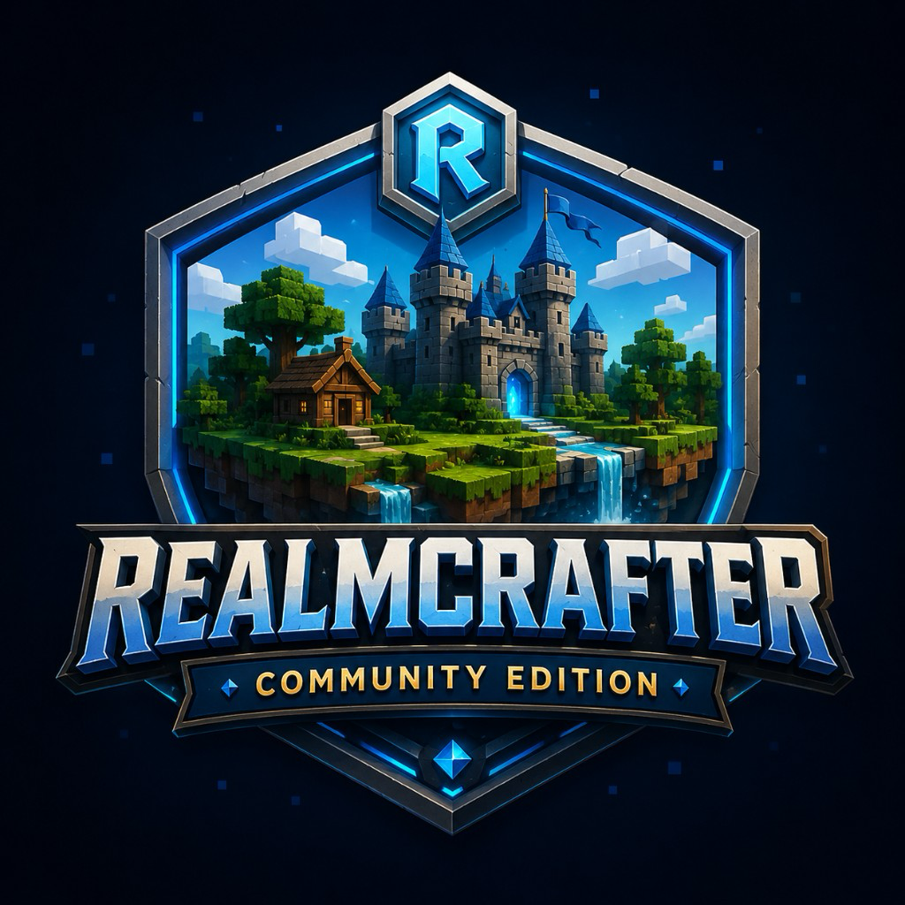

<div align="center">



# RealmCrafter: Community Edition

### The open-source MMORPG engine, reborn.

**Build vast online worlds without writing a renderer, a netcode stack, or a database layer from scratch.**
RCCE picks up where the original RealmCrafter left off — modernized, cross-platform, community-driven, and free forever.

---

[](https://github.com/RydeTec/rcce2/actions/workflows/ci.yml?query=branch%3Adevelop)
[](https://github.com/RydeTec/rcce2/releases/latest)
[](https://github.com/RydeTec/rcce2/releases)
[](https://github.com/RydeTec/rcce2/stargazers)
[](https://github.com/RydeTec/rcce2/issues)
[](https://github.com/RydeTec/rcce2/pulls)
[](https://github.com/RydeTec/rcce2/commits/develop)
[](https://github.com/RydeTec/rcce2/discussions)

[](https://github.com/RydeTec/rcce2/releases)
[-orange?logo=apple&logoColor=white)](docs/macos-apple-silicon.md)
[](compiler/BlitzForge)

</div>

<p align="center">
  <a href="https://github.com/RydeTec/rcce2/releases/latest"><b>Download</b></a> ·
  <a href="docs/index.md"><b>Docs</b></a> ·
  <a href="https://github.com/RydeTec/rcce2/discussions"><b>Discussions</b></a> ·
  <a href="https://realmcrafter.boards.net/"><b>Community Forum</b></a> ·
  <a href="https://realmcrafter.fandom.com/"><b>Wiki</b></a> ·
  <a href="#contribute"><b>Contribute</b></a>
</p>

---

## Why RCCE

RealmCrafter was one of the earliest tools that let solo developers and small teams build *real* MMORPGs — persistent worlds, characters, quests, NPCs — without rolling their own engine. Then it stopped being maintained. The community refused to let it die.

**RealmCrafter: Community Edition (RCCE)** is the actively-developed continuation. Same accessibility. New foundations.

| | Original RealmCrafter | RCCE |
|---|---|---|
| Status | Abandoned | **Actively maintained** |
| Platforms | Windows only | **Windows (stable) + macOS Apple Silicon (alpha)** |
| Compiler | Closed-source Blitz3D | **[BlitzForge](compiler/BlitzForge) — open-source fork with ARM64 codegen** |
| Tooling | Frozen | Modern VS Code extension, native IDEs, CI |
| License model | Proprietary | Community / open development |
| Community | Forum-only | GitHub, Discord, Discussions, Forum |
| Bug fixes | None | Continuous |
| Pull requests | N/A | Welcome from anyone |

## What's in the box

- **Game Engine** — A complete client/server runtime for building 3D MMORPGs.
- **Project Manager** — A visual launcher that creates, configures, builds, and packages your game.
- **World Editor (Architect)** — Place terrain, meshes, NPCs, spawn points, and quest triggers.
- **Scripting System** — Familiar BlitzBasic-style game scripting (`Server Data/Scripts`) — no C++ required to ship a game.
- **BlitzForge Compiler** — Our modernized Blitz3D toolchain, vendored at [`compiler/BlitzForge`](compiler/BlitzForge), with cross-platform Mach-O / PE output.
- **Networking + Persistence** — RCEnet networking and SQL/MySQL backends out of the box.
- **VS Code Extension** — Syntax highlighting, build, debug, and test workflows for the Blitz language ([`extras/vscode-blitz-forge`](extras/vscode-blitz-forge)).
- **Sample Content** — A populated [default project](data) so you can launch a working world in minutes.

## Quick start

### Install a release (recommended)

1. Grab the latest build for your OS from [**Releases**](https://github.com/RydeTec/rcce2/releases/latest).
2. Unzip it.
3. Launch **Project Manager** (`Project Manager.exe` on Windows, `Project Manager` on macOS).
4. Open the bundled sample project, hit **Run Server**, then **Run Client**.

> **macOS users — alpha.** RCCE produces native Apple Silicon binaries via [BlitzForge's macOS port](compiler/BlitzForge#macos-apple-silicon--alpha), which is currently **alpha**: the runtime path is incomplete, many language and standard-library features are not yet wired up, and breakage is expected. Use the macOS build for development and feedback, not for shipping a game. See [macOS Apple Silicon notes](docs/macos-apple-silicon.md) for the current source-build flow and compatibility caveats.

### Build from source

```bash
git clone --recurse-submodules https://github.com/RydeTec/rcce2.git
cd rcce2
```

Forgot the submodules?

```bash
git submodule update --init --recursive
```

**Windows:**

```bat
compile.bat            :: build engine + tools
compile.bat -b         :: also rebuild the BlitzForge toolchain
publish.bat            :: produce a redistributable release
```

**macOS (Apple Silicon):**

```bash
./scripts/bootstrap_macos.sh    # one-time toolchain setup
./compile.sh -b                 # build BlitzForge (blitzcc + runtime/linker)
./compile.sh                    # build engine + tools
./test.sh                       # compile the Blitz test suite
./publish.sh                    # produce a redistributable release
```

Useful flags (both platforms): `-b` rebuild BlitzForge, `-e` skip engine, `-t` skip tools.

## Repository layout

```
rcce2/
├── src/                        # Engine source (BlitzBasic): Client, Server, GUE, Project Manager, Tests
├── data/                       # Default game project (worlds, scripts, assets)
├── compiler/BlitzForge/        # Modernized Blitz3D compiler + runtime (submodule)
├── extras/vscode-blitz-forge/  # VS Code language extension (submodule)
├── extras/reshade/             # ReShade integration (submodule)
├── docs/                       # Engine + scripting documentation
├── release/                    # Build artifacts produced by publish scripts
├── scripts/                    # Cross-platform build helpers
└── bin/                        # Runtime binaries (compiled / vendored)
```

## Documentation

- **[Getting Started](docs/start.md)** — your first project
- **[macOS Apple Silicon Notes](docs/macos-apple-silicon.md)** — source-build steps, release notes, and alpha caveats
- **[Module Reference](docs/reference.md)** — engine APIs
- **[Format Reference](docs/formats.md)** — file formats and conventions
- **[RealmCrafter Wiki](https://realmcrafter.fandom.com/)** — legacy gameplay and editor docs
- **[BlitzForge](compiler/BlitzForge)** — compiler internals and language reference

> Docs are a work in progress. Improvements are one of the highest-leverage ways to contribute — see below.

## Roadmap highlights

- ✅ Cross-platform build scripts (`compile.sh`, `publish.sh`, `bootstrap_macos.sh`)
- ✅ ARM64 code generation in BlitzForge
- 🚧 macOS arm64 native runtime (Mach-O, no Wine/Rosetta) — **alpha**, not production-ready
- 🔄 Filling in the macOS runtime to reach feature parity with the Windows runtime
- 🔄 Continued modernization of the rendering and audio backends
- 🔄 Documentation overhaul
- 🔮 Linux runtime (community interest tracked in [Discussions](https://github.com/RydeTec/rcce2/discussions))

## Contribute

We welcome contributors at every level — players reporting bugs, scripters polishing the default project, artists improving sample assets, and engine developers landing C++ and Blitz changes.

### How you can help

| You are a... | You can... | Start here |
|---|---|---|
| **Player / hobbyist** | File bugs, request features, write tutorials | [Issues](https://github.com/RydeTec/rcce2/issues) · [Ideas](https://github.com/RydeTec/rcce2/discussions/categories/ideas) |
| **Game designer** | Improve the default project — quests, NPCs, balance, UI | [`data/`](data) |
| **Scripter** | Improve gameplay scripts in BlitzBasic | [`data/Server Data/Scripts`](data/Server%20Data/Scripts) |
| **Blitz developer** | Improve engine source (Client / Server / Tools) | [`src/`](src) |
| **C++ developer** | Improve the compiler and runtime | [`compiler/BlitzForge/src`](compiler/BlitzForge/src) |
| **Writer** | Improve docs and onboarding | [`docs/`](docs) |
| **Tester** | Add tests in the [`src/Tests`](src/Tests) folder; they run on every commit | `test.bat` |

### Workflow

1. Fork or clone, then branch from `develop`.
2. Make focused changes (small first PRs are encouraged).
3. Run `test.bat` — tests run automatically on commit; they must pass.
4. Open a PR targeting `develop`. Releases are PRs from `develop` → `master`.

See [CONTRIBUTING.md](CONTRIBUTING.md) for the full guidelines — build flags, the code conventions reviewers look for (soft-fail / atomic-write / Null discipline / privilege gating), Blitz3D / BlitzForge gotchas, the test-runner flake-retry recipe, and where to ask questions.

To get push access, request to join the [**RCCE Contributors team**](https://github.com/orgs/RydeTec/teams/rcce-contributors).

## Community

- **GitHub Discussions** — [github.com/RydeTec/rcce2/discussions](https://github.com/RydeTec/rcce2/discussions)
- **Forum** — [realmcrafter.boards.net](https://realmcrafter.boards.net/) · [Source board](https://realmcrafter.boards.net/board/7/source)
- **Discord** — invite link is available from the **RCCE Project Manager**
- **Wiki** — [realmcrafter.fandom.com](https://realmcrafter.fandom.com/)

## Tooling and resources

<details>
<summary><b>VS Code Blitz extension</b> — install instructions</summary>

```bash
cd extras/vscode-blitz-forge
nvm use 22.10.0
npm install
npm run build
```

In VS Code: `Ctrl+Shift+P` → **Install from VSIX** → select the generated `blitzforge-*.vsix`.
The extension exposes compile / debug / test / publish launch configurations.
</details>

<details>
<summary><b>Native IDEs</b></summary>

Both BlitzForge and the legacy BlitzRCPlus ship with native IDEs in their `compiler/` folders. Additional Blitz IDE installers are bundled in [`extras/`](extras).
</details>

<details>
<summary><b>ReShade</b> — modern post-processing</summary>

Run the ReShade setup in [`extras/`](extras) to (re)install. Press **Shift+F12** in the running client to open the control panel. Copy `bin/ReShade.ini.example` to `bin/ReShade.ini` first; otherwise the default control panel hotkey is **Home**.
</details>

<details>
<summary><b>Audio conversion (OGG)</b></summary>

A bundled copy of Freemake (in [`extras/`](extras)) bulk-converts audio files to OGG.
</details>

<details>
<summary><b>Custom executable icons</b></summary>

Use [Resource Hacker](https://www.angusj.com/resourcehacker/) to swap the BlitzForge default icon on your shipped game executable.
</details>

## Acknowledgments

RCCE stands on the shoulders of:

- The original **RealmCrafter** team — for the vision.
- **Blitz Research** and the **BlitzBasic / Blitz3D** community — for the language that powers it.
- Everyone who kept the forum alive while the project was dormant.
- Every contributor who has filed a bug, opened a PR, or shipped a tutorial.

## License

RealmCrafter: Community Edition is a community-maintained continuation of the original RealmCrafter project. Licensing for individual subsystems (engine source, vendored libraries, ReShade, FastExtension, sample content) follows the licenses shipped alongside each component — see the relevant files in [`extras/`](extras) and submodule directories. For questions about reuse, redistribution, or commercial use, please open a [Discussion](https://github.com/RydeTec/rcce2/discussions) or contact the maintainers.

---

<div align="center">

**Build something massive.**

[Download](https://github.com/RydeTec/rcce2/releases/latest) · [Star the repo](https://github.com/RydeTec/rcce2) · [Join the discussion](https://github.com/RydeTec/rcce2/discussions)

</div>
